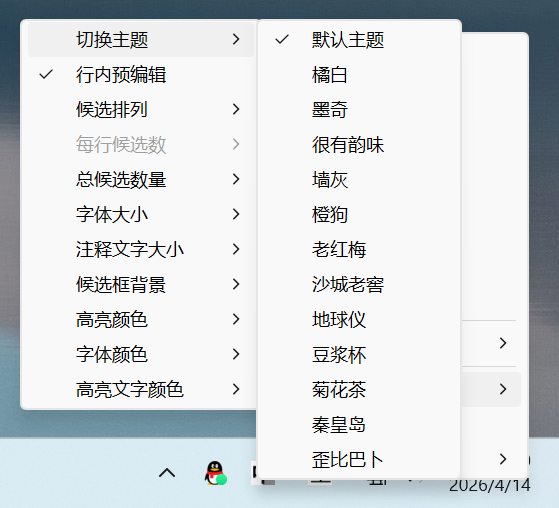
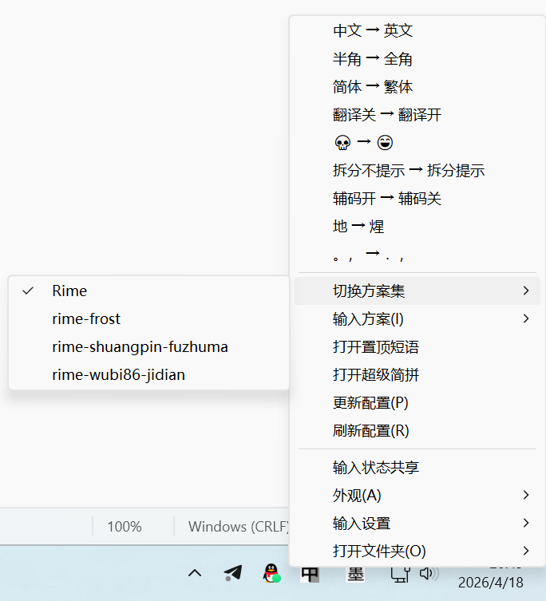
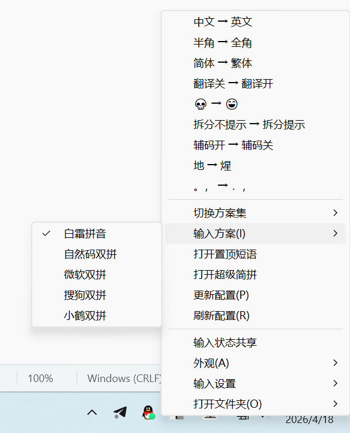
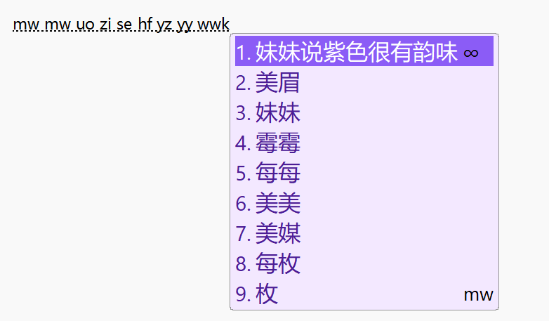
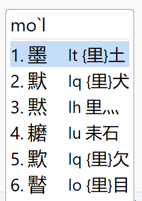
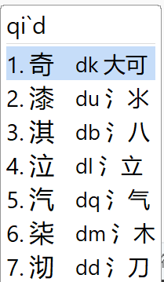

# Moqi IM for Windows

Windows 端的输入法前端，负责把 `moqi-ime` 后端接入 **Microsoft Text Services Framework (TSF)**，并提供候选窗、语言栏按钮、组合串上屏等 Windows 平台能力。

当前状态：已实现 **[Rime / 中州韵](https://github.com/rime/librime)** 输入法接入，**fcitx5** 输入法接入中。

项目 TSF 层核心依赖：[`libIME2`](https://github.com/EasyIME/libIME2)。很大程度上参考了[PIME](https://github.com/EasyIME/PIME) 以及 [小狼毫](https://github.com/rime/weasel) 项目。

核心引擎：[`moqi-ime`](https://github.com/gaboolic/moqi-ime)。

## 快速开始
下载安装包：[moqi-im-windows-setup.exe](https://github.com/gaboolic/moqi-im-windows/releases)

## 特色功能
- 托盘切换输入法状态：中英文 全半角 简繁
- 外观编辑：主题皮肤切换、字体调整、主题色切换、自定义快捷键
- 切换方案集、切换输入方案、更新配置
- 置顶短语、超级简拼
- 输入设置：自动插入成对引号、分号键次选
- 原生ai功能：支持整句优化、翻译、问答等，只有想不到没有做不到。编辑C:\Users\用户名\AppData\Roaming\Moqi\Rime\ai_config.json 可以接入ai大模型以及自定义提示词、快捷键

```
{
  "api": {
    "base_url": "",
    "api_key": "",
    "model": ""
  },
  "actions": [
    {
      "name": "写好评",
      "hotkey": "Ctrl+Shift+G",
      "prompt": "请围绕“{{candidate_1}}”生成最多 3 条适合直接发布的中文好评，每条 20 字左右。"
    },
    {
      "name": "优化整句",
      "hotkey": "Ctrl+Shift+O",
      "prompt": "上一句是：{{previous_commit}}\n原始输入拼音是：{{composition}}\n前三个候选词：\n{{candidates_top3}}\n请严格遵循原始输入拼音来选字，只能在符合这串拼音的候选范围内优化整句，不要凭空改成不匹配拼音的字词。只输出 1 条最通顺、最自然的整句候选，不要解释。"
    },
    {
      "name": "中译英",
      "hotkey": "Ctrl+Shift+E",
      "prompt": "请把当前中文内容翻译成自然、地道的英文。 “{{candidate_1}}” 只输出 1 条英文翻译，不要解释。"
    },
    {
      "name": "问答",
      "hotkey": "Ctrl+Shift+Q",
      "prompt": "用户询问： “{{candidate_1}}” 只输出 1 条答案，不要解释。"
    }
  ]
}
```

## 功能演示
ai功能演示：https://github.com/gaboolic/moqi-im-windows/issues/4









## 运行架构

```
┌─────────────────────────────────────────────┐
│           Windows 应用程序                 │
│      (记事本 / Word / 浏览器 / 其他)        │
├─────────────────────────────────────────────┤
│  MoqiTextService.dll                        │
│  - TSF 接口实现                             │
│  - 按键事件/组合串/候选窗处理               │
│  - 通过命名管道连接 Launcher                │
├─────────────────────────────────────────────┤
│  MoqiLauncher.exe                            │
│  - 读取 backends.json                       │
│  - 管理后端进程生命周期                     │
│  - 在命名管道与后端 stdin/stdout 之间转发消息│
├─────────────────────────────────────────────┤
│  moqi-ime\server.exe                        │
│  - Go 后端进程                              │
│  - 加载 input_methods\*\ime.json            │
│  - 返回候选、状态、上屏文本等               │
└─────────────────────────────────────────────┘
```

当前默认部署中，`backends.json` 指向 `moqi-ime\server.exe`；Windows 侧通过本地命名管道连到 `MoqLauncher`，`MoqLauncher` 再把请求按行写入后端的标准输入，并从标准输出读取响应。

## 核心职责

- **TSF 文本服务**：实现 `ITfTextInputProcessor`、`ITfKeyEventSink` 等接口
- **Windows UI**：管理候选窗口、消息窗口、语言栏按钮和 preserved keys
- **协议转换**：把按键与状态序列化为 JSON 请求，并应用后端返回的组合串、候选和提交文本
- **后端接入**：通过 `MoqLauncher` 读取 `backends.json`，按语言配置 GUID 路由到对应后端

## 与 `moqi-ime` 的关系

本仓库不实现拼音解析、候选生成、词库管理等输入法核心逻辑，这些能力由 `moqi-ime` 提供。

Windows 侧的职责主要是：

- 把 TSF 生命周期和按键事件转发给后端
- 根据后端返回结果更新候选窗、组合串和状态
- 从已安装后端目录扫描 `input_methods/*/ime.json`，为语言配置提供元数据与配置入口

因此，`moqi-im-windows` 与 `moqi-ime` 需要配套部署。

## 技术栈

- **语言**：C++ 、GO
- **框架**：Microsoft TSF、Win32 API
- **进程/IO**：命名管道、子进程 `stdin/stdout` 转发、`libuv`
- **数据格式**：protobuf(见/proto/moqi.proto)
- **日志**：`spdlog`
- **构建**：CMake + Visual Studio 2022 / MSBuild

## 源码布局

- `MoqiTextService`：TSF 文本服务，产出 `MoqiTextService.dll`
- `MoqLauncher`：后端启动器与消息转发器，产出 `MoqiLauncher.exe`
- `libIME2`：IME/TSF 基础库，也是本项目 TSF 层的核心依赖，来源：[`gaboolic/libIME2`](https://github.com/gaboolic/libIME2)
- `libuv`：Launcher 的事件循环与进程/管道依赖
- `backends.json`：后端清单，定义后端名称、启动命令和工作目录
- `scripts`：构建脚本
- `installer/`：Inno Setup 安装器脚本与输出目录

## 构建

前置：**Visual Studio 2022**、**CMake 3.21+**、Windows SDK。

在本仓库根目录执行：

   `powershell -ExecutionPolicy Bypass -File .\scripts\_all_in_package.ps1`

该脚本会生成安装器：`installer\dist\moqi-im-windows-setup.exe`

## 参考文档

- [Microsoft TSF 文档](https://docs.microsoft.com/en-us/windows/win32/tsf/text-services-framework)
- [ITfTextInputProcessor 接口](https://docs.microsoft.com/en-us/windows/win32/api/msctf/nn-msctf-itftextinputprocessor)

## 友情链接

白霜拼音 <https://github.com/gaboolic/rime-frost>

墨奇音形 <https://github.com/gaboolic/rime-shuangpin-fuzhuma>

墨奇五笔整句 <https://github.com/gaboolic/rime-wubi-sentence>

### Star History

[](https://star-history.com/#gaboolic/moqi-im-windows&Date)